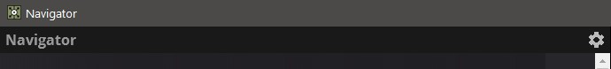
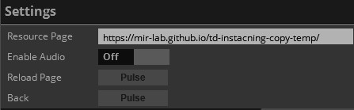
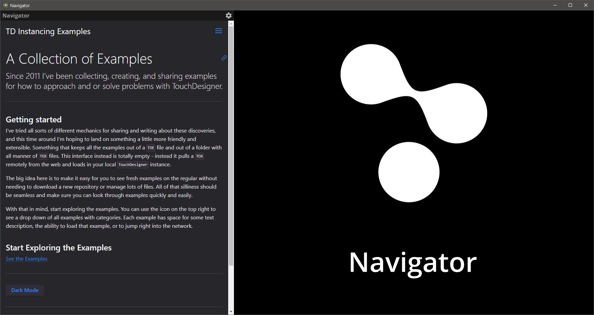
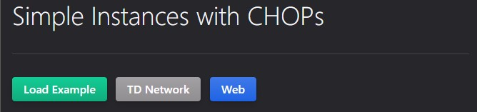

# TouchDesigner Resource Navigator

An easy to use remote resource navigation and example tool kit - using the flexibility of the web to render rich text embedded directly in TouchDesigner. Following along with examples, see them in action, and even open up networks to see how they work.

# Getting Started
To view these examples you'll need to use the TouchDesigner Navigator.

You can find the [Navigator here].

Download the toe file from the `/release` directory. Or [click here.]

Once you've opened the Navigator, use the Gear icon located in the upper left of the documentation pane to view the project's settings:

Use the parameter `Resource Page` to set the target website for the navigator to use. Use the resource link listed in the project description for the navigator.

Once you've loaded a resource page, use the webpage on the left side of the interface to find and load examples.

While using the TouchDesigner Navigator you can `Load` remote TOX files, `Open` a floating TouchDesigner network, or open the same `Web` page in another browser:

Happy programming!